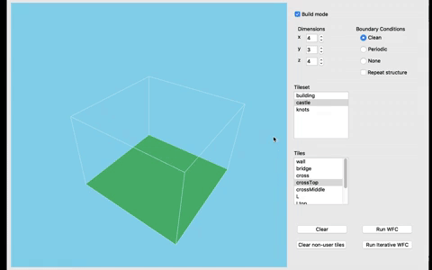
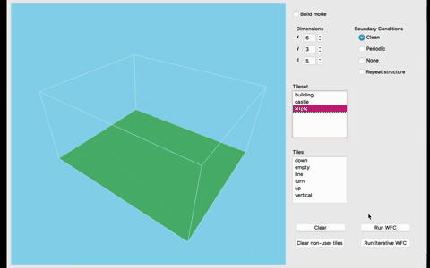
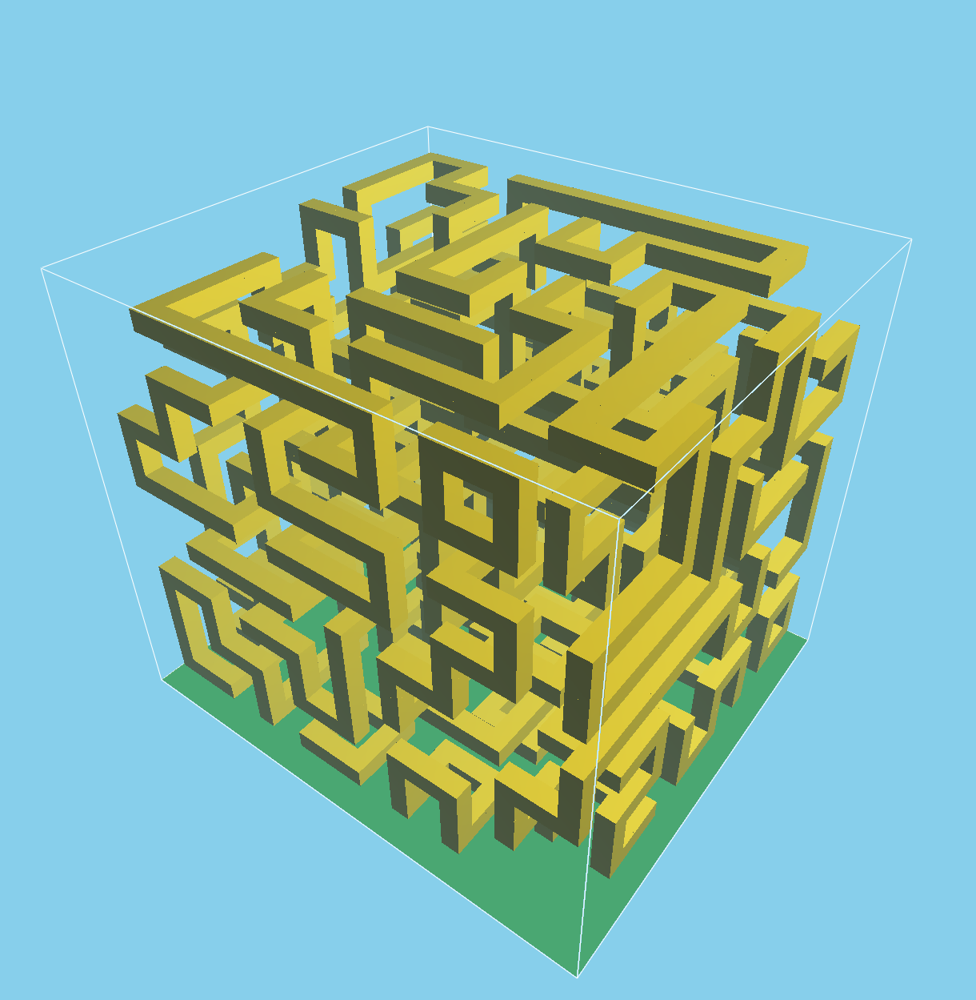
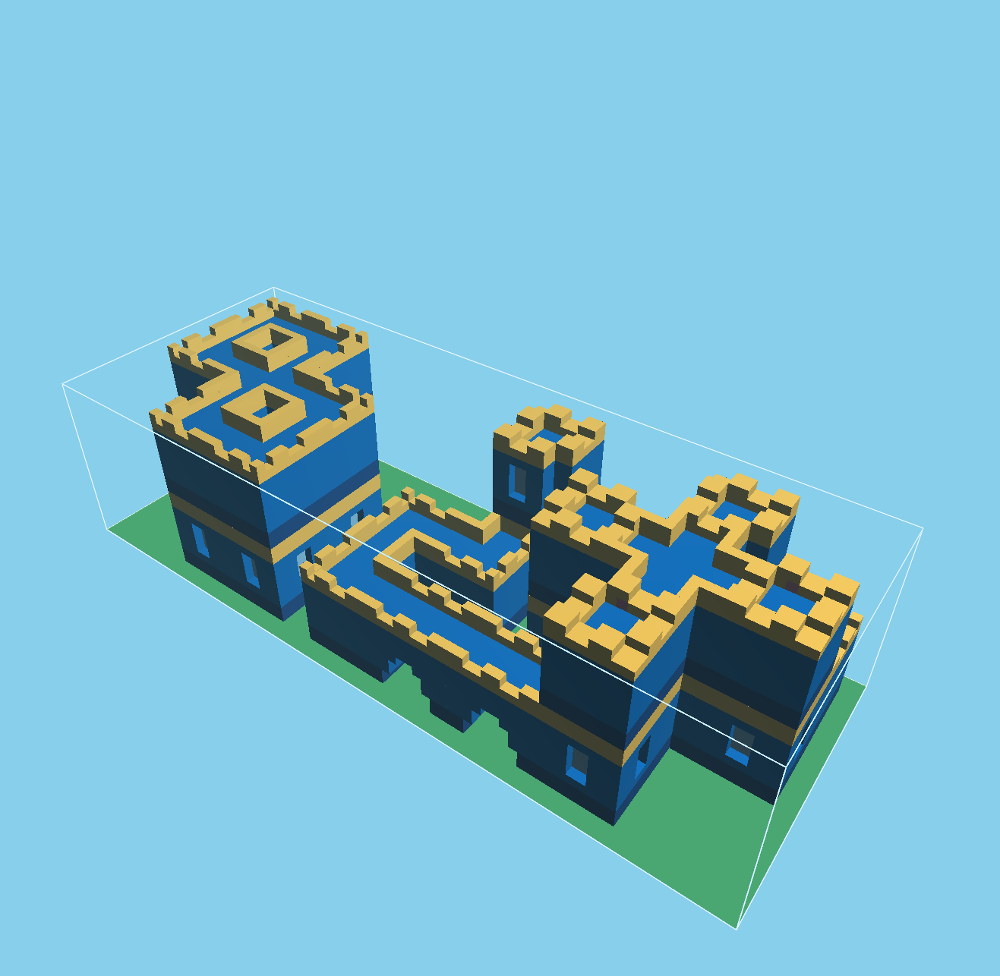
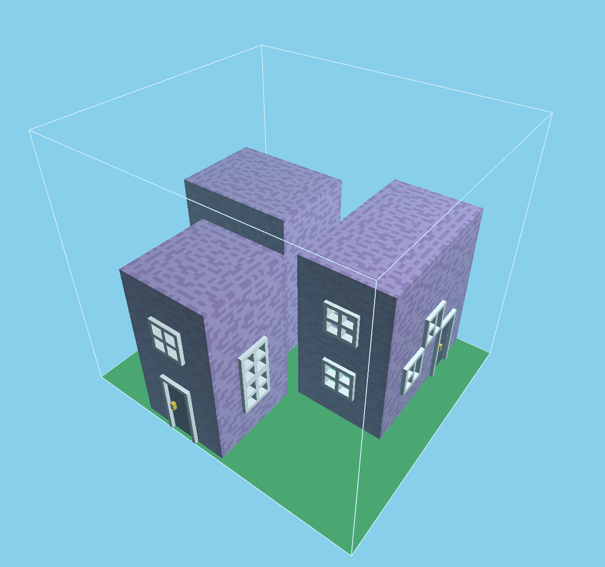

# Wave Function Collapse
**A C++, voxel-based implementation of [the WFC algorithm](https://github.com/mxgmn/WaveFunctionCollapse) for a senior capstone project**

## Overview
A C++, voxel-based implementation of Wave Function Collapse. This algorithm takes in a tileset and some adjacency information about those tiles (which tiles can sit next to which, and in what direction) and can generate infinite configurations in an NxNxN grid using those tiles. A video presentation and demo can be found [here](https://vimeo.com/333982662).

### Build Mode
This implementation featues a build mode, in which the user can place down starting tiles and then run the algorithm. 

  

### Iterative Mode
There is also an option to watch the algorithm run iteratively: at the start, each grid cell contains a transparent cube representing the potential tiles that can be placed in that cell. As the algorithm progresses, the number of valid tile options for a given cell decreases, and the transparent cube in that cell decreases in size until it disappears completely and is replaced by that cell's observed tile.

  

## Tilesets
The "knots" tile set was created by the original author, while I created the other two tile sets in MagicaVoxel.
Knots          | Castle          | Buildings  | 
:-------------------------:|:-------------------------:|:-------------------------:|
|  | |

## Future Steps
As of writing this readme, it's been several years since I worked on this project and there are lots of things I would change! The most obvious is to instance the tile meshes, as any configuration will contain the same 10 or so tiles with different translations and rotations. In general, thinking about this project from a more data-oriented mindset would probably help a lot. It would also be interesting to add a backtracking algorithm to resolve unsolvable configurations, which can happen not infrequently depending on the tile set selected and number of user tiles placed in build mode.
